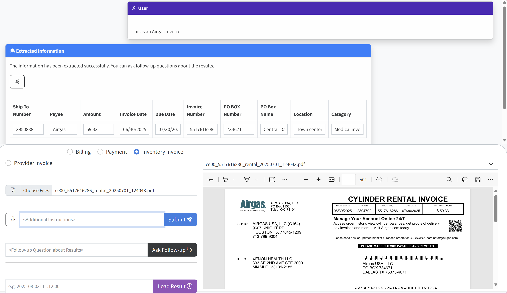
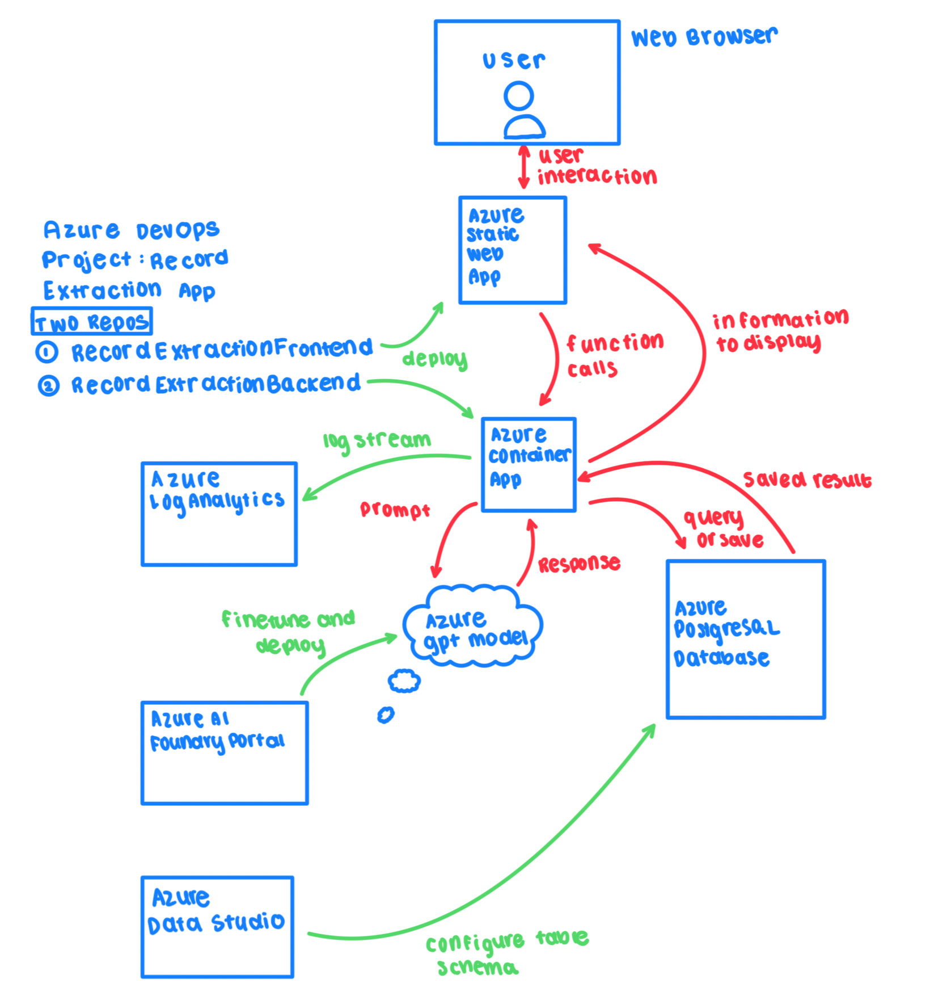

<!--
---
name: Electronic Health Record Extraction App Frontend
description: An app that renders the frontend for an Azure Container App that uses Azure OpenAI to extract specific information from uploaded PDF files of health records.
languages:
- python
- javascript
- bicep
- azdeveloper
products:
- azure-openai
- azure
- azure-container-apps
page_type: sample
urlFragment: openai-chat-vision-quickstart
---
-->
# Electronic Health Record Extraction App

This repository includes all of the front end code to host a web app that uses Azure OpenAI to extract specific information from uploaded PDF files of health records.

The project includes all the infrastructure and configuration needed to provision Azure OpenAI resources and deploy the app to [Azure Static Web Apps](https://learn.microsoft.com/en-us/azure/static-web-apps/overview) using the [Azure DevOps CI/CD](https://azure.microsoft.com/en-us/products/devops/?msockid=15120cad72a26ff73d2e1aa573606e57).

* [Features](#features)
* [Architecture diagram](#architecture-diagram)
* [Getting started](#getting-started)
  * [GitHub Codespaces](#github-codespaces)
  * [VS Code Dev Containers](#vs-code-dev-containers)
  * [Local environment](#local-environment)
* [Deploying](#deploying)
* [Development server](#development-server)
* [Costs](#costs)
* [Security guidelines](#security-guidelines)
* [Resources](#resources)

## Features

* A basic HTML/JS frontend that handles interactive features such as file upload, PDF file preview, user text input, and csv download.
* Proxy cors connectioin that sends back end calls to the Azure Container App `rec-ex-app-2wccj467-ca-back`.
* Speech input and output buttons that use the free built-in browser APIs.

## Architecture diagram

## Getting started

### Azure DevOps

You can continuosly develop and deploy this app using Azure DevOps. This project is called `RecordExtractionApp` and the main owner of the project is [billing@xenonhealth.com](billing@xenonhealth.com). Once your account is added as a Contributor to the project, you will be able to develop the codebase.
1. Relevant Azure CLI Login keys are found in the **RecordExtractionApp_CLILogin_Vars** variable group in the project's Library, found under Pipelines.
2. The main CI/CD pipeline for this app is titled `RecordExtractionFrontend`. It should take ~3 minutes to integrate any committed changes.

### Accessing app endpoint

The Azure Static Web App containing the front-end of the EHR Extraction App is titled `rec-ex-app-frontend` and is owned by the [billing@xenonhealth.com](billing@xenonhealth.com) Azure account.
1. Access the endpoint URL for the app by navigating to `rec-ex-app-frontend` in the [Azure Portal](https://portal.azure.com/signin/index/) and click on *URL* in the **Overview** of the app.
2. Copy-paste the *URL* to your desired web browser to use the app. It is currently [https://icy-island-0d9782c0f.1.azurestaticapps.net](https://icy-island-0d9782c0f.1.azurestaticapps.net).

## Guidance

### Costs

The Azure Static Web App is currently hosted with a Standard Hosting Plan that costs $9/month. More information about pricing for the app can be found on the [Azure website](https://azure.microsoft.com/en-us/pricing/details/app-service/static/?msockid=15120cad72a26ff73d2e1aa573606e57).

⚠️ To avoid unnecessary costs, remember to take down the app if it's no longer in use.

### Resources

About this app:
About this app:
* [User Manual](https://docs.google.com/document/d/17vpTEgW7pZxo4fvFnLWOS700H28p9FfkcPLRyhukga0/edit?usp=sharing): Yubi Mamiya's user manual of the EHR Extraction App.
* [Project Workflow](https://docs.google.com/presentation/d/19f-rZHBwsyk8X2XxWWtSCqYNQyF4mWQxXxgLeIR0-X4/edit?usp=sharing): Yubi Mamiya's detailed report of the technical progress of the EHR Extraction App.
* [Final Presentation](https://docs.google.com/presentation/d/1DdVqYQX41UTfBu8wFK52KoqnCogkOGU-sNT-AFmFXcE/edit?usp=sharing): Yubi Mamiya's overview of the EHR Extraction App.

 Related samples and docs:
* [Speech Input/Output](https://blog.pamelafox.org/2024/12/add-browser-speech-inputoutput-to-your.html): Explains the speech buttons used in this app.
* [OpenAI Chat Vision Quickstart](https://github.com/Azure-Samples/openai-chat-vision-quickstart): Base repository for this app.